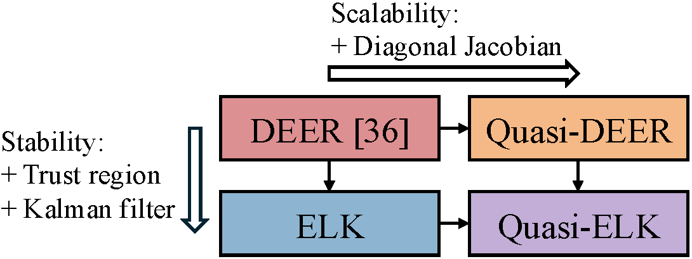

# Scalable and Stable Parallelization of Nonlinear RNNs

This repository contains code for the paper "Towards Scalable and Stable Parallelization of Nonlinear RNNs," published in NeurIPS 2024. The paper is available on ArXiv [here](https://arxiv.org/abs/2407.19115). The primary contributions of our paper are the quasi-DEER and ELK algorithms. quasi-DEER is a scalable algorithm. ELK, which stands for "**E**valuating **L**evenberg-Marquardt with **K**alman, is a stable algorithm. We also contribute quasi-ELK, which is both scalable and stable.



Our paper and codebase build on the work of YH Lim, *et al.*, in "Parallelizing non-linear sequential models over the sequence length", ([paper](https://arxiv.org/abs/2309.12252), [codebase](https://github.com/machine-discovery/deer)) published in ICLR 2024. This work from Machine Discovery Ltd is licensed under the [BSD 3-Clause License](https://github.com/machine-discovery/deer/blob/main/LICENSE). The particular files in our codebase from DEER are `deer.py` and the folder `fig3`; and much of the set-up in `qdeer_profile_exps_figs_2_5_6` comes from the analogous [experiments](https://github.com/machine-discovery/deer/tree/main/experiments/01_speed_benchmark) in DEER, though we contribute the memory profiling code.

## Installation Instructions

We recommend using a virtual environment. **Use python 3.12.1**

Within that virtual environment, first install JAX with
```
pip install --upgrade pip
pip install -U "jax[cuda12]"
```

After installing JAX, pip install the package with
```
pip install --upgrade -e .[cr]
```

We originally wrote the paper in Python 3.9, but this required running in a singularity container and using old verisons of JAX. Using the code is much easier in Python 3.12.1 and the provided `setup.py`.

### Installation into a Google colab

Google Colab runs with Python 3.10

To install into a Google colab, `git clone` this repo, and then `cd` into `elk`. First, `import jax`, and then run `pip install --upgrade -e .[flex]`

## Versions

This is a living repo which will change as we develop more applications. See [the tag v1.0.0](https://github.com/lindermanlab/elk/releases/tag/v1.0.0) for the version corresponding to our [NeurIPS paper](https://arxiv.org/abs/2407.19115)

## Citation
```
@inproceedings{gonzalez2024scalable,
  title={Towards Scalable and Stable Parallelization of Nonlinear RNNs},
  author={Xavier Gonzalez and Andrew Warrington and Jimmy T. H. Smith and Scott W. Linderman},
  booktitle={Advances in Neural Information Processing Systems (NeurIPS)},
  year={2024},
  url={https://doi.org/10.48550/arXiv.2407.19115},
}
```
